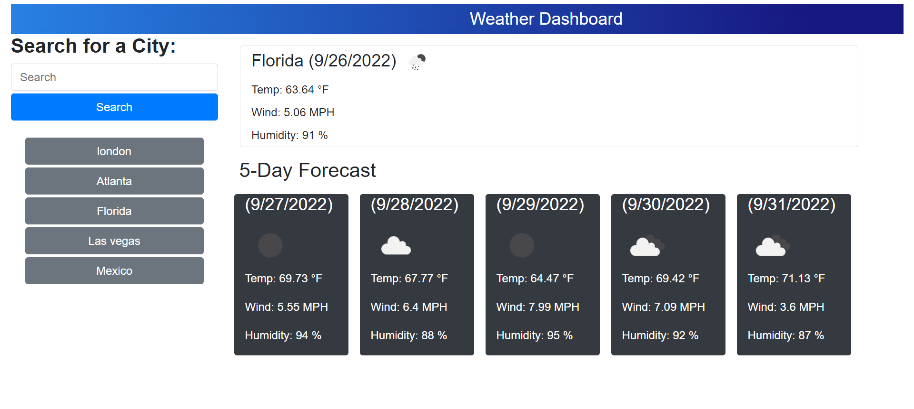

# D6-GetTheWeather
Visualizar el pronóstico del clima para diferentes ciudades
## Descipción
* Aplicación web para visualizar pronostico del clima actual y 5 dias despues de una ciudad buscada.

## Captura de pantalla
La captura de pantalla demuestra la apariencia y funcionalidad de la aplicación web:

## Enlaces
URL de GitHub
* https://caro2102.github.io/D6-GetTheWeather/

URL de repositorio de GitHub
* https://github.com/Caro2102/D6-GetTheWeather
